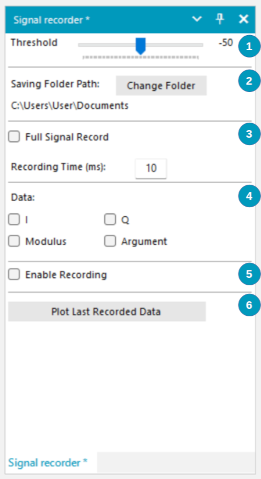
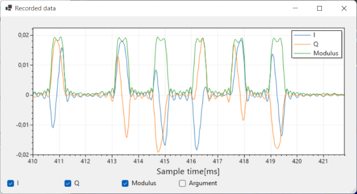

# SDRSharp.Plugin.SignalRecorder
Signal recorder plugin for SDRSharp.

Windows binary available in the Releases page.

## Instructions

1. The signal level (db) above witch the recording stars whan enabled.
1. The folder where the recorded data will be saved.
1. 
   - If NOT *Full Signal Record* the recording time. The time starts when the signal exceeds the threshold set in (1).
   - If *Full Signal Record* the time the signal can stay lower than the threshold set in (1) before stopping the recording.
2. The data that will be saved.
3. When checked the recorder waits for a signal greater than the threshold and than it starts to record the signal. It is possible to stop a recording unchecking the box.
4. If desired the last recorded data can be plot directly.

In the plot window it is possible to move around the data, zoom, pan and enable/disable drawings.

## Installing instructions
Copy the *SDRSharp.Plugin.SignalRecorder* and the two *ScottPlot* dlls into the SDRSharp Plugin folder. 

Enjoy.

## Compiling instructions
(updated to april 2022)

Go to [Airspy website download page](https://airspy.com/download/) and download the *SDR# SDK for Plugin Developers* (for .NET 6).

Clone the *SDRSharp.Plugin.SignalRecorder* repository inside the solution folder.

Make sure the project folder is next to the SDK *lib* folder.

Open the project with Visual Studio 2022 and compile the project.

The *SDRSharp.Plugin.SignalRecorder* with the *ScottPlot* dlls are found inside the *SDRSharp.Plugin.SignalRecorder\bin\Release\net6.0-windows\\* (or *SDRSharp.Plugin.SignalRecorder\bin\Debug\net6.0-windows\\*) folder.